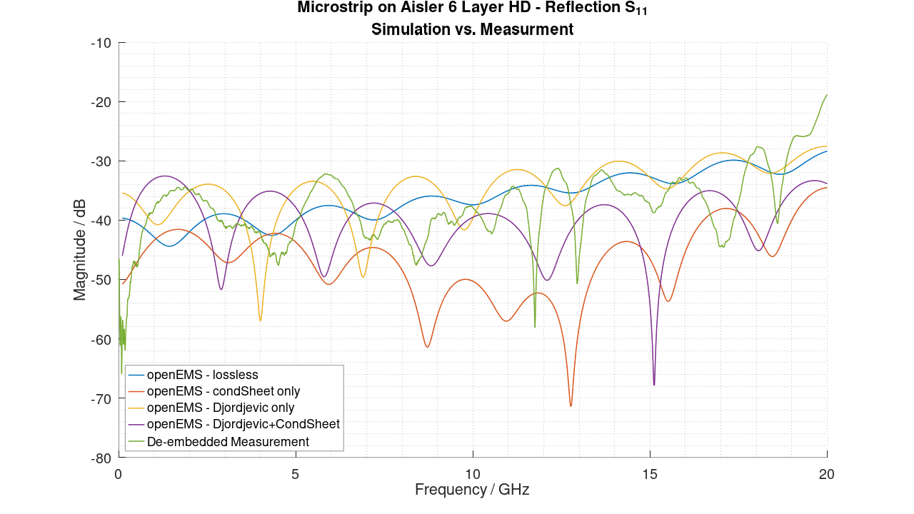
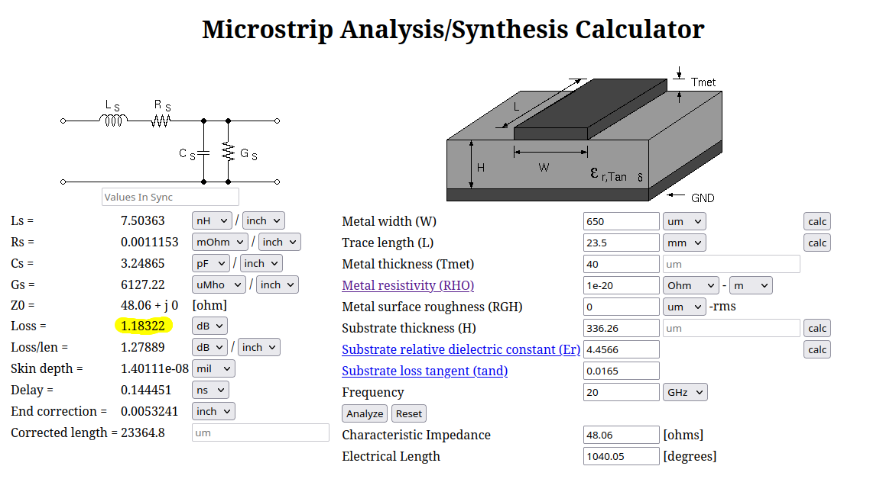
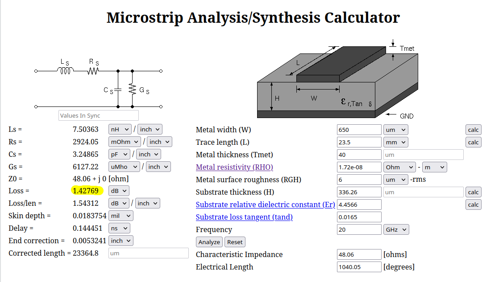

# Experiments with openEMS and Multi-Term-Debye/Djordjevic-Sarkar Models

In the last weeks I took a closer look at substrate losses in the context of openEMS simulations. More specifically the Debye and Djordjevic-Sarkar [1] models.

The Djordjevic-Sarkar model was suggested by an experienced user in the context of my [Microstrip to SMA transition model](https://github.com/thliebig/openEMS-Project/discussions/88). Another user has opened a discussion thread for [wideband dielectric models](https://github.com/thliebig/openEMS-Project/discussions/99) where he published some simulations in Sonnet for comparison to openEMS. 

The Djordjevic-Sarkar was originally developed for FR4-type materials based on measured data. The idea is to have $\epsilon''$ (imaginary part) approximately constant between two corner frequencies $\omega_1 = 10^{m_1}$ (lower limit) and  $\omega_2  = 10^{m_2}$ (upper limit). With this assumption it is possible to create a wide band model with only one $\epsilon_r$, $tan_\delta$ pair at a single frequency. The model is implemented in several commercial simulators (CST, HFSS, Simberian). According to a variety of sources this model works well for materials with an almost constant loss tangent (very common for PCB materials). The Djordjevic model is roughly speaking a Debye model with an infinite number of terms, but it can be approximated by a finite number of poles. With some math it is possible to solve for the unknowns by choosing an appropriate number of Terms. In a second step the Debye model can be (approximately) converted into the Lorentz model as defined in openEMS

## Motivation

Currently I am working on a open source tunable band pass filter. The plan is to make a co-simulation of QUCS (models for lumped elements and the varactor) and openEMS (for the passive filter structure). To achieve close agreement between measured and simulated results it is  critical to get all losses right. In the passive structures as well as in the lumped component models. This is why I started to look into the substrate and metal losses.

## The DUT (Device Under Test)

The low cost Rosenberger 32K242-40ML5 connector combined with my wide band transition is an enabler for accurate de-embedding using the [IEEEP370 open source 2xThrough](https://opensource.ieee.org/elec-char/ieee-370) method. Accurate wide band de-embedding can be achieved. From the two projects I have two calibration lines of different lengths (See Figure below). By de-embedding the half sections of the short transmission line from  the longer one connector effects are removed. The length difference is 23.5mm.

<p align = "center"></p>
<p align = "center">Figure 1: DUT, two transmission lines of different lengths on Aisler 6 layer stackup (FR4)</p>

 Both are fabricated on the same [Aisler 6Layer HD stackup](https://community.aisler.net/t/6-layer-hd-pcb-stackup/1703). To get a reasonable substrate thickness for RF (filter) design the upper prepreg and the core have to be combined. This is bad for the insertion loss due to the lossy core martial. However, this is the price to pay when using an ultra low cost PCB.

The material parameters are taken from the [substrate datasheets (min./max values)](https://community.aisler.net/uploads/short-url/1oBcIOZ5qPiZRUQdlzBzAUm1VJg.pdf) linked by Aisler and the [Panasonic datasheet](https://industrial.panasonic.com/content/data/EM/PDF/CDS_HF_R-1566(W_WN)_R-1551(W_WN)_22070140.pdf).


The maximum $tan_\delta=0.035$ value for the laminate is very high. Typical values in the datasheet are around $tan_\delta=0.013$ (a low value for an FR4 laminate). These datasheet values are known to be very optimistic. Are these values trustworthy? I dont´t know at this point. Therefore, I went with a typical value for FR4 of tand=0.02. For the prepreg the datasheet typical value form the datasheet was taken. 

```
Prepreg_1080_Panasonic-R-1551W, Er=4.3,tand = 0.013
Core_7628_Panasonic-R-1566W, Er = 4.6, tand=0.02
```

The figure below shows a de-embedded VNA measurement of the transmission line.

<p align = "center"></p>
<p align = "center">Figure 2: DUT, de-embedded measurement</p>

## OpenEMS Simulation Model

A openEMS simulation model was written to recreate the DUT from above with a length of 23.5mm. 

Four test cases were simulated
- Lossless Simulation (no substrate and metal losses)
- Conductor losses only (AddConductingSheet())
- Substrate losses only (AddDjordjevicSarkarMaterial())
- Combined losses (AddConductingSheet() and AddDjordjevicSarkarMaterial())

<p align = "center"></p>
<p align = "center">Figure 3: Simulation Model, AppCSXCAD</p>

The current result of my work is a function `AddDjordjevicSarkarMaterial()` that calculates a multi term wide band material model. In short - without providing too much details - the following steps are performed:

1. Calculate Djordjevic-Sarkar model from the users $\epsilon_r$ and $tan_\delta$
2. Select suitable frequency points to perform a fit to a multi-term Debye Model
3. Fit to multi-term Debye Model
4. Abuse the Lorentz model implementation to reassemble the Debye model

Example call:
```
    CSX = AddDjordjevicSarkarMaterial(CSX, 'Sub01', 4.3, 0.015, 6e9, 200e9, 'f1', 10^4/(2*pi));
```

Here are debug plots that show the model fit of  multi term Debye and Lortentz model in linear and logarithmic scale

<p align = "center"></p>
<p align = "center"></p>
<p align = "center">Figure 4: Djordjevic-Sarkar Model fit output for Prepreg_1080_Panasonic-R-1551W</p>

The "abuse" of the Lorentz model comes with some [stability problems](https://github.com/thliebig/openEMS-Project/discussions/140). In the time domain the frequency dependent material properties are handled by an equivalent circuit approach. My function basically forces the equivalent circuit of the Lorentz model to be equal to the Debye one. Maybe here some instability occurs.

In its current state I would not consider `AddDjordjevicSarkarMaterial()` to be save to use. The cleanest way would be to add the Debye model into openEMS along with the Lorentz model (This is certainly a topic of discussion). However, I consider this is a long term project.  If anybody needs a wide band dielectric model desperately (like me :) `AddDjordjevicSarkarMaterial()` can be used at own risk.

## Results

The output of the simulation model for the 4 test cases are be plotted in one graph. Transmission losses for the lossless case are almost zero at a very low value. I noticed that at these low attenuation values event the PML boundary thickness has an influence because it changes the the value of reflected waves.

<p align = "center"></p>
<p align = "center">Figure 4: Simulation Results - Transmission</p>

Substrate and conductor losses were added sequentially. For comparison the measured transmission is also included. We can see, that the simulation has to low losses. Especially, when  conductor losses are considered by `AddCondSheet()` (wide band model for skin effect). I think that the conductor losses are probably not treated well. Copper roughness effects are not included. This is in my experience required.

The used stack up is - most certainly - not optimized for RF. It was just very cost-effective for me to source. The copper roughness may indeed be high. In PCB manufacturing, high surface roughness on the dielectric side is preferred to strengthen the bond between the copper foil and the dielectric. It increases the immunity against delamination. Aisler had most certainly no RF applications in mind and optimized for durability.

Models for conductor loss can produce significantly different outputs. Especially, the Hammerstad-Jensen model has a term in it that saturates towards higher frequencies. This prevents the loss term from growing. However, the loss in real models does indeed grow. Therefore, the Hammerstad-Jensen model underestimates' conductor loss for higher frequencies significantly. The models is considered accurate only for frequencies up to 5 GHz.

For completeness here is the plot for S11.

<p align = "center"></p>
<p align = "center">Figure 4: Simulation Results - Reflection</p>

## Verify using WCALC
I have now verified the results above using an equation-based microstirp analysis tool. WCALC is a great tool. It provides references to all the equations used. It is also free. It is supplied as a web calculator and also in binary form to be installed on a computer. 

https://wcalc.sourceforge.net/about.html

It uses the Hammerstad-Jensen model where the saturation effect can be observed. The loss value does not change much for higher frequencies and higher roughness values.

### Substrate losses only

The two dielectrics I have simulated above have different values of tand (I guessed the core metal to have a loss tangent around 0.02). I went simply with the mean value of the two tand=0,0165. As the core is thicker, the effective loss tangent will be slightly higher. WCALC reports a loss value of 1.18dB for the substrate losses only case. This is very close to my simulated 1.22dB loss. This suggests that substrate losses are indeed treated correctly

<p align = "center"></p>
<p align = "center">Figure 5: WCALC - Substrate Losses Only</p>

### Substrate and metal losses

Activating metal losses do not change the result significantly. Please note, that the saturation effect described above of the Hammerstad-Jensen is active here. We therefore expect the results of WCALC not to match the measures ones.

<p align = "center"></p>
<p align = "center">Figure 4: WCALC - Substrate and metal losses</p>

For refernce: Here is a link to the used models of WCALC. https://wcalc.sourceforge.net/microstrip.html


## Problems Remaining

- For my filter PCB I cannot use the `AddCondSheet()` model. The filter is highly sensitive to coupling effects between transmission lines. I must model the traces with their proper thickness. To my knowledge there is no way to treat metal losses of volumetric shapes without a very fine mesh to capture the skin effekt. A new model for metal losses must be implemented in openEMS
- Stablility Problems due to Lorentz model approximation. A native implementation of the Debye model will solve this issue.

## References
[1] Djordjevic, Antonije R., et al. "Wideband frequency-domain characterization of FR-4 and time-domain causality." IEEE Transactions on electromagnetic compatibility 43.4 (2001): 662-667.

## Link to Diskussion in the openEMS forum
Please find the code and measured touchstone files in my repository:
https://github.com/thliebig/openEMS-Project/discussions/157
